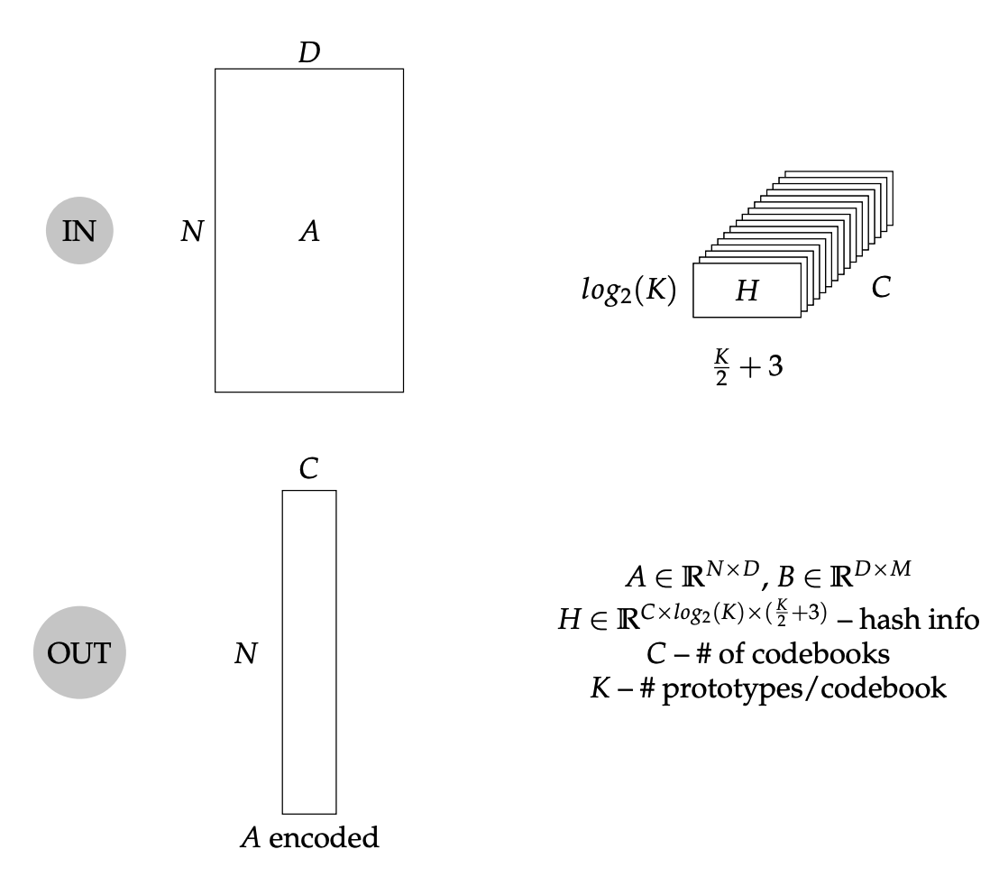

# Halutmatmul

[](https://github.com/joennlae/halutmatmul/actions/workflows/gpu_tests.yaml)
[](https://github.com/joennlae/halutmatmul/actions/workflows/python_testing.yaml)
[](https://github.com/joennlae/halutmatmul/actions/workflows/linting.yaml)
[](https://github.com/joennlae/halutmatmul/actions/workflows/python_mypy.yaml)
[](https://github.com/joennlae/halutmatmul/actions/workflows/cpp_testing.yaml)

* Based on [MADDness/Bolt](https://github.com/dblalock/bolt).
* More information about the base project is [here](maddness/README.md)
* [arXiv](https://arxiv.org/abs/2106.10860) paper link

## General Information

This repo is used for the algorithmic exploration. I will try to update this repo with as much hardware information as I am allowed to publish.

## Install

```bash
# install conda environment & activate
conda env create -f environment_gpu.yml
conda activate halutmatmul

# IIS prefixed env
conda env create -f environment_gpu.yml --prefix /scratch/janniss/conda/halutmatmul_gpu

# install CLI
./scripts/install-cli.sh

# now use CLI with
halut --help

# or without install
./halut --help
```

## Hackernews mention (comments only) and discussion

* [HN: Bolt: Faster matrix and vector operations that run on compressed data](https://news.ycombinator.com/item?id=31792206)

## Progress Slides

* [Week 11 slides](https://github.com/joennlae/halutdata/raw/master/slides/week_11.pdf)
* [Weekly updated slides](http://jsdev.vsos.ethz.ch/maddness/progress-slides.pdf)


## `CUDA` kernels

* [Encode Kernel](src/python/halutmatmul/cuda/kernels/encode.cu)
* [Decode Kernel](src/python/halutmatmul/cuda/kernels/read_acc_lut.cu)

_I am aware that there is still a lot that could be optimized here (warp etc.), but it was only developed for fast analysis_

## Results

Caveats: No retraining and fine-tuning done yet!
### Single Layer replacement with `C=32` and `K=16`

### LeViT ([Source](https://github.com/facebookresearch/LeViT))

SOTA Vision Transformer on ImageNet 1K


### ResNet-50 (only interesting layers in analysis)
Legacy Classifier on ImageNet 1K


### Depthwise seperable CNN
on Google Speech v2


### `C`, `K` and `encoding_algorithm` parameter sweep for ResNet-50

* [Data visualizer](http://jsdev.vsos.ethz.ch/halut/)
_be sure to select ResNet-50 layers `layerX.X.convX`_


### Offline learning convergence on ResNet-50

The goal was to find out how much offline training data is needed to get the maximum accuracy.


## Formalism

Some definitions about the forward path.

### Encode kernel

### Read and accumulate LUTs kernel

### Links

* [Addendum](docs/addendum.md)